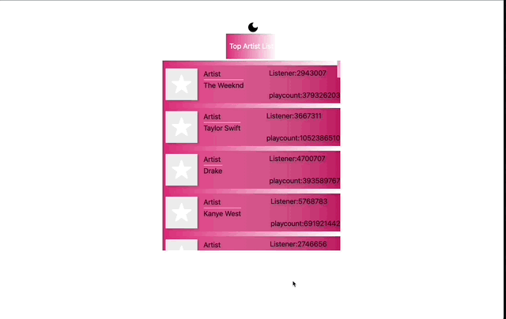

  Project Name     |How does my project look   
:------------------------|-------------------------
[Last Fm](https://mucahit-lastfm.netlify.app)| 

## LAST.FM 

#### Data in the project is taken from the Last.fm API.This application "Top Artists" and "Top Albums" and "Top Tracks" of these artists can be accessed.
The user will see the most listened "Top Artists" on the home page.
When the user clicks on "Top Artists", user will see "Top albums" and "Top Tracks" of that artist.
User can turn dark mode on and off

### Technologie

-React
-Redux Toolkit
-Cypress Testing
-Storybook
